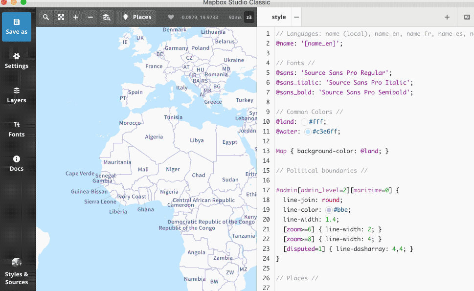
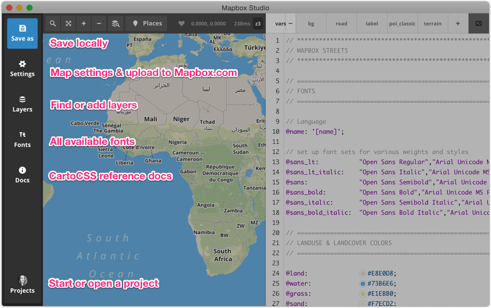
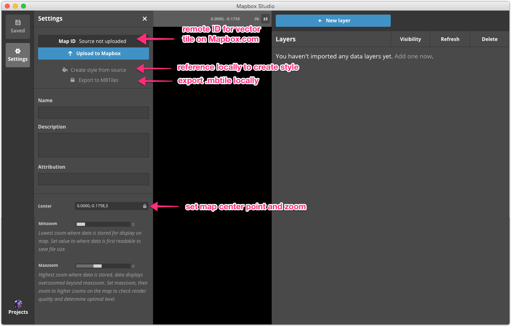
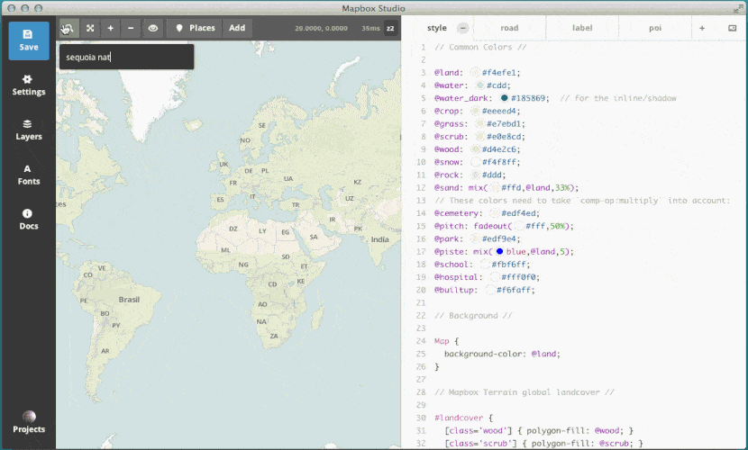

# Classic styles

You can use the style mode in Mapbox Studio Classic to create map styles. A **[classic style](https://www.mapbox.com/help/define-classic-style/)** is a set of rules for how your map will be drawn on the page – it includes references to your data, map images (icons, markers, patterns), fonts, and, most importantly, it defines how all of your data should be styled on your map.

## What is a style?

**Styles** contain the design rules that customize the display of your maps. Mapbox Studio Classic styles are written using a language called [*CartoCSS*](https://www.mapbox.com/help/define-cartocss), which assigns certain style properties (like color, line-width, opacity, etc.) to your data features. The way in which features are styled can be modified based on the map's zoom level and your data's attributes. Once you're finished editing your style, you'll upload it to your Mapbox account where it will appear on your [Classic styles page](https://www.mapbox.com/help/studio/classic/styles/) with a [map ID](https://www.mapbox.com/help/define-map-id) so you can use it with other Mapbox tools and a __share URL__ so you can share or embed it on your website.

Sources and styles are independent; the same style can be applied to different data sources and the same data source can power different styles. This makes iterative map designing fast and efficient.

*Different map styles using the same Mapbox Streets vector tile data source.*

## Manage styles

You can view your styles by clicking the **Styles & Sources** button at the bottom left of the Mapbox Studio Classic interface and toggling to **Styles**.

### Style projects

When you save your source for the first time, Mapbox Studio Classic will automatically create a **style project** to organize your style assets. A Mapbox Studio Classic **style project** is stored in a single directory with a `.tm2` file extension. A typical style project directory looks like this:

    sample-project.tm2/
        project.yml
        project.xml
        style.mss
        .thumb.png
        assets/
            park.png
            cafe.png

- **project.yml** is the main project file in YAML format. Mapbox Studio Classic uses this file to assemble other style project assets, including style project metadata, references to a style's tileset sources, and CartoCSS stylesheets.
- **project.xml** is a compiled, ready-to-publish Mapnik XML file for the project.
- **style.mss** and any other mss files contain the CartoCSS stylesheets that define the project's style.
- **.thumb.png** is a thumbnail image that serves as a quick preview of the project.
- **assets** is a directory that you'll need to create manually when you save your style project. You can store your style project anywhere, but by adding this directory and including the raw images, fonts, or other custom assets that comprise you style, you'll make your project portable and organized.

### Create a new style

Click the **Styles & Sources** button at the bottom left of the Mapbox Studio Classic interface to view your styles and sources. Click **+ New style or source** to create a new style or **Browse** to load an existing style project. Read more information about the two options below:

#### New style or source

Mapbox Studio Classic comes with 16 starter styles for you to use or customize for your final map designs.

If you'd like to use one of these map styles in your project, even if you'll eventually be adding custom tilesets, select a style to get started.

If you don't want to use these map styles in your project and would rather start with a blank style, you can type the [map ID](https://www.mapbox.com/help/define-map-id) of your custom tilesets into the form at the bottom of your screen and click **Create**. If you created your tileset in Mapbox Studio Classic source mode, make sure you've uploaded your source to your Mapbox account first. You can find the [map ID](https://www.mapbox.com/help/define-map-id) of your tilesets from your [**Tilesets**](https://www.mapbox.com/help/studio/tilesets) page. Click the hamburger menu next to the tileset and the clipboard icon next to the map ID to copy it.

#### Browse

You can upload an existing style project by clicking **Browse** and using the interface to navigate to where your .tm2 style project folder is stored locally. Once you've found your style project folder, click **Open**.

Make sure your style is **Saved** before navigating to a different Style or Source to avoid losing your work.

## Editing a style

### Style interface

Before you start building your style, be sure to familiarize yourself with the style editor interface. The source interface contains, from left to right:  project settings, the live preview of your style, and the CartoCSS panel.

### Add custom data

To add custom data to your Mapbox Studio Classic style, you'll need to use your tileset source's [map ID](https://www.mapbox.com/help/define-map-id). If you created your tileset in Mapbox Studio Classic source mode, make sure you've uploaded your source to your Mapbox account first. You can find the [map ID](https://www.mapbox.com/help/define-map-id) of your tilesets from your [**Tilesets**](https://www.mapbox.com/help/studio/tilesets) page. Click the hamburger menu next to the tileset and the clipboard icon next to the map ID to copy it.

Navigate back to your open Mapbox Studio Classic style project. Click **Layers**, and the **Change source** button. Paste the map ID in the form at the bottom and click **Apply**.

###  Compositing sources

Mapbox Studio Classic styles can include multiple tileset sources. When multiple sources are added to the same style in Mapbox Studio Classic, they're automatically composited, or combined into a single tileset. To composite your source, or add your source to an existing style, add a comma to the end of the current map ID, then paste your map ID (with *no space*) after the comma.

### Source layer order

Sources are rendered in order in which they are listed in the style editor. So for example, if you click **Change source** and you see `your.mapid,mapbox.mapbox-streets-v5`, the layers from `mapbox.mapbox-streets-v5` will render last, on top of the layers from `your.mapid`. This is especially important if you're using a Mapbox default style as your basemap since in most cases you'll want your custom data to render on top of this basemap. To ensure that your own data renders last, use `mapbox.mapbox-streets-v5,your.mapid`.

### Styling with CartoCSS

To style the sources you've added to your style project, you'll need to write CartoCSS. Check out the [CartoCSS](https://www.mapbox.com/help/studio-classic-cartocss) guide in this manual to get started.

## Publishing styles

### Style options

The **Settings** button at the top left of your style editor window opens a new panel where you can upload your style to your Mapbox account or store your style locally in a style package.

Before you package your style, be sure to review the following options and save your style.

**Name**. This will be the name of your style in the in the **Styles & Sources** panel and in your [Classic](https://www.mapbox.com/help/studio/classic/styles/) page from your Mapbox account. If this field is left blank, you style will be named 'Untitled'.

**Description**. An optional field to describe the style. This will only be visible from your style editor.

**Attribution**. You must attribute Mapbox maps in the same fashion as you would cite a photograph: in a textual description near the image. Add the following to the attribution field:

    © Mapbox © OpenStreetMap

Now that you've reviewed your style options, you can package your style for rendering. Read more information about the two options below.

#### Upload to Mapbox

From the **Settings** menu, click **Upload to Mapbox** to upload your classic style your Mapbox account's [Classic](https://www.mapbox.com/help/studio/classic/styles/) page. The classic style will have the [map ID](https://www.mapbox.com/help/define-map-id/) shown in the **Map ID** field. You can use this map ID to add a style to another of Mapbox project.

#### Download a package

From the **Settings** menu, click **or download as a package** to download your style as a package. Mapbox Studio Classic styles are packaged into `.tm2z` files for publishing on Mapbox.com or downloading locally. The package contains only the styling information and no data and thus is relatively small. Inside it are:

- `project.xml` &mdash; the Mapnik-ready XML style definition automatically built by Mapbox Studio Classic from the project's CartoCSS files and `project.yml`.
- `.png`, `.jpg`, and `.svg` files, unless they begin with `_`.

All other files are omitted from packaging. A `.tm2z` file should not be used as a backup of your `.tm2` project as the original CartoCSS styles are not stored in it or recoverable from it.

## Creating a static image

Once you've styled and saved your map, you can export it to a static map for printing! With vector tiles, Mapbox Studio Classic maps are print ready and your data renders across all media in sharp detail. The resolution independence of vector tiles now makes it possible to create a map with flexible resolution appropriate for high quality printing.

### How to export an image

With Mapbox Studio Classic's export functions, you can set your canvas size, image type (.png or .jpg), and resolution for a printable image.

1. Pan and zoom to the your area of interest.
1. Click on the image icon in the upper right of Mapbox Studio Classic to open up the export pane.
1. Use the bounding box to set the export area.
1. Adjust the crop size, crop bounds, center point, image format and resolution as needed.
1. Select download and save it to your local drive.

### Printing options

You can create a [static map](https://www.mapbox.com/help/api-documentation/#static-classic) from a [classic style](https://www.mapbox.com/help/define-classic-style) or a map designed in [Mapbox Studio Classic](https://github.com/mapbox/mapbox-studio-classic) using Mapbox Studio Classic's image export tool or by writing the API call manually to the [Mapbox Static API (Classic)](https://www.mapbox.com/api-documentation/pages/static_classic.html). The Mapbox Studio Classic export tool also allows the export of high resolution images from classic styles.

Export options:

- **Extent** is adjusted by using the bounding box that is located over the map.
- **Zoom level** for the final image will be at the same zoom level that is currently being displayed (note how label sizes adjust).
- **Crop size** changes the height and width dimensions of the print by pixels or inches.
- **Crop bounds** are the geographic coordinates used for the image extent.
- **Center point** is the latitude and longitude at the center of the image.
- **Image format** options are PNG or JPEG (vector file formats are not available).
- **Resolution** can be set at 150ppi, 300ppi, or 600ppi.

## Add pop-ups

You can add pop-ups to your Mapbox Studio classic map by enabling UTFGrid interactivity. UTFGrid interactivity can be added to style projects by manually editing the `project.yml` file and filling out these additional fields:

- `interactivity_layer`: the ID of the layer that should be made interactive.
- `template`: a UTFGrid [html/mustache template](https://github.com/mapbox/utfgrid-spec/blob/master/1.3/interaction.md#template) used to display data on tooltips.
