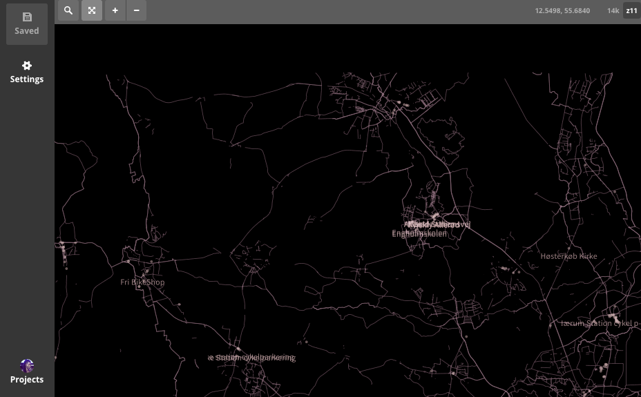
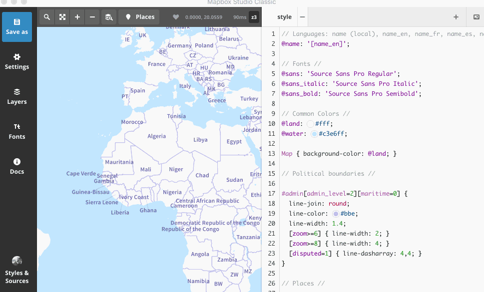
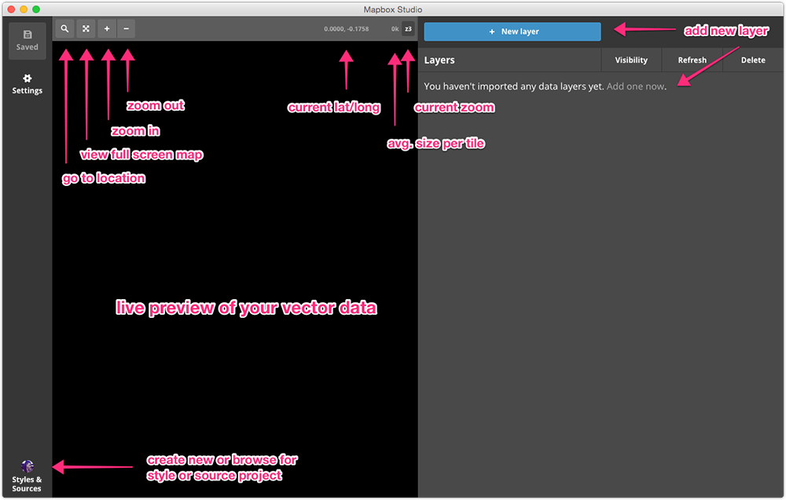
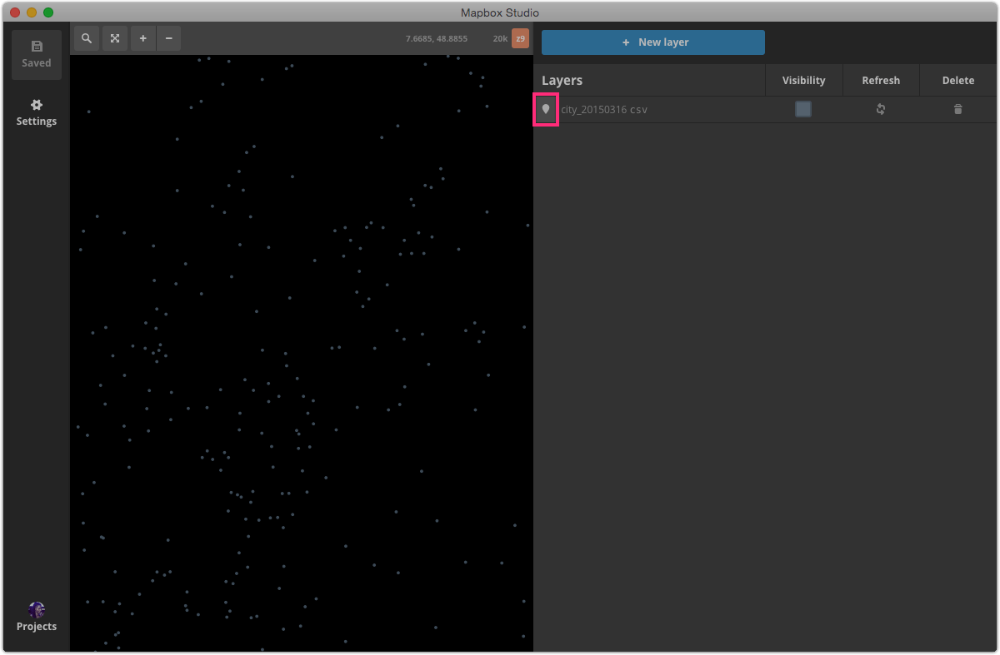
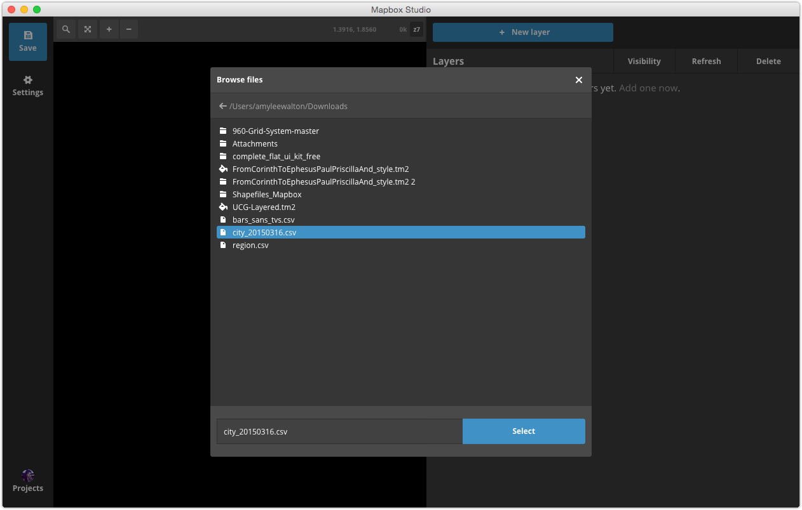
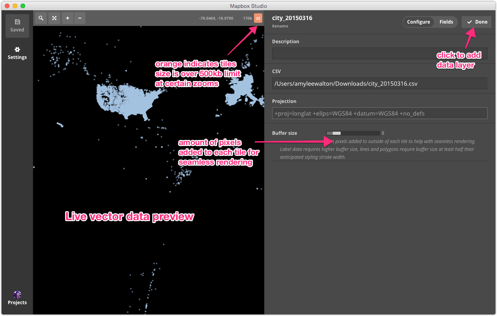
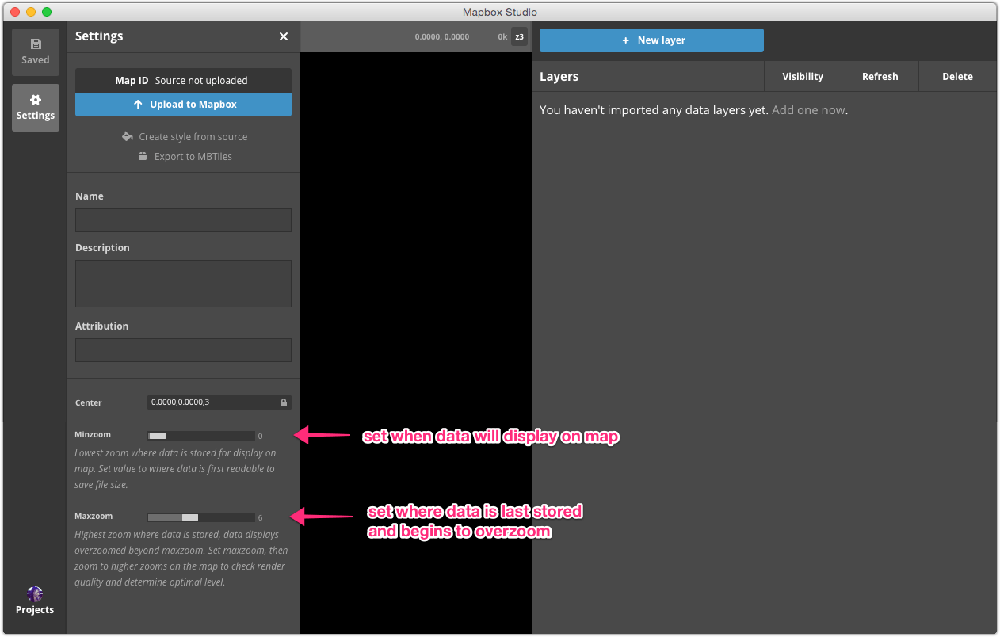

# Sources

You can use the source mode in Mapbox Studio Classic to import one or more custom data layers and export them to a vector or a raster tileset. You can then style these tilesets using Mapbox Studio Classic's style mode or use them in another Mapbox project.

*Custom data converted to vector tiles, composited with Mapbox data, and then styled.*

## What is a source?

A source is made up of one or more data layers added in source mode in Mapbox Studio Classic that can be exported to a tileset. Data layers can be stored locally or come from a PostGIS or SQLite database and must be in one of the following file formats:

* [GeoJSON](https://www.mapbox.com/help/define-geojson)
* [Shapefile](https://www.mapbox.com/help/define-shapefile)
* [GeoTIFF](https://www.mapbox.com/help/define-tiff)
* [VRT](https://www.mapbox.com/help/define-vrt)
* [KML](https://www.mapbox.com/help/define-kml)
* [GPX](https://www.mapbox.com/help/define-gpx)
* [CSV](https://www.mapbox.com/help/define-csv) containing **latitude** and **longitude** fields

## Manage sources

You can view your sources by clicking the **Styles & Sources** button at the bottom left of the Mapbox Studio Classic interface and toggling to **Sources**.

### Source projects

When you save your source for the first time, Mapbox Studio Classic will automatically create a **source project** to organize your data layers. This project is stored in a single directory with a `.tm2source` file extension. A typical source project directory looks like this:

    source-project.tm2source/
        data.yml
        data.xml
        .thumb.png
        data/
            cafes.csv
            roads.geojson

- **data.yml** is the main project file in YAML format. It contains core project metadata.
- **data.xml** is a compiled Mapnik XML file.
- **.thumb.png** is a thumbnail image to preview the project.
- **data** is a directory that you'll need to create manually when you save your source project. You can store your source project anywhere, but by adding this directory and including the raw data that comprises your source, you'll keep your project portable and organized.

### Create a new source

Click the **Styles & Sources** button at the bottom left of the Mapbox Studio Classic interface to view your styles and sources. Click **+ New style or source** to create a blank source or **Browse** to load an existing source project. Read more information about the two options below.

#### New style or source

Click the **Blank source** button from the *New style or source* modal in Mapbox Studio Classic.

#### Browse

You can upload an existing source by clicking **Browse** and using the interface to navigate to where your `.tm2source` source project folder is stored locally. Once you've found your source project folder, click **Open**.

Make sure your source is **Saved** before navigating to a different Style or Source to avoid losing your work.

## Editing a source

### Source interface

Before you start building your source, be sure to familiarize yourself with the source editor interface. The source interface contains, from left to right: project settings, the live preview of your sources, and data layers with values, attributes, and connection information.

Once you've added data layers to your source, you can click the **Zoom to data** icon to view the full extent of your data layer or to jump back and forth between layers.

You can view your data feature attributes by clicking the search icon to search for a feature or by clicking on a feature.

### Add custom data

Click the **New layer** button to the right of the source editor to open a new modal where you can navigate to your data. Once you've found your data, click **Select**. You should now see your data layer appear in the live data preview.

While you can add as many data layers as you'd like to your source, each layer can only contain one file. Make sure you data is in a [supported file format](#what-is-a-source).

### Data layer options

Once you've selected your data, a menu will open to the right of the preview window where you can specify data layer options.

Use the **Configure** toggle to give your data layer a description, change the path to your original data source, view the original data projection, or modify the buffer size.

When you import a data source using **Add layer**, you can set the **buffer size** for the source. A buffer on a layer allows you to include extra data around the outside of each tile. Depending on the data and desired styles this can be necessary to ensure seamless rendering across tile boundaries. Tile buffers are set individually for each layer; different layers have different requirements and it's important to make boundaries no larger than necessary in order to keep the size of your vector tiles to a minimum.

The buffer setting is measured in pixels (assuming that the vector tile is rendered at 256&times;256 pixels).

General guidelines when setting the buffer size:

- Buffers for label layers should be quite large &mdash; often 128 pixels.
- Buffers for line and polygon layers should be at least half the width of the widest stroke you think you'll want to draw.

Use the **Fields** toggle to view your data layer's attribute fields and modify the attribute descriptions.

Click **Done** when you've finished modifying your data layer.

### Data layer order

In Mapbox Studio Classic's source editor, you can drag and drop layers in the layer list to reorder them. This is helpful when you've added multiple layers to single source project. The order they're listed here will be the order they're stored in the vector tiles and the default order they'll be drawn in a style. Layers at the top of the list will be drawn on top of layers further down.

### Refreshing data

If your data changes, you can refresh your data layer within source mode in Mapbox Studio Classic by clicking the **Refresh** button.

## Publishing sources

### Source settings

The **Settings** button at the top left of your source editor window opens a new panel where you can convert your source to a raster or vector tileset.

Before you create tiles from your source, make sure to review the following options.

**Name**. This will be the name of your source in the **Styles & Sources** panel and in your **[Tilesets](https://www.mapbox.com/studio/Tilesets/)** page from your Mapbox account. If this field is left blank, you tileset will be named 'Untitled'.

**Description**. An optional field to describe the source. This will only be visible from the Mapbox Studio Classic source editor.

**Attribution**. You must attribute Mapbox maps in the same fashion as you would cite a photograph: in a textual description near the image. Add the following to the attribution field:

    © Mapbox © OpenStreetMap

**Center**. The latitude and longitude of your source's center followed by the zoom level in the format `latitude,longitude,zoom-level`. The default is `0,0,0`. You can enter these values manually or pan and zoom to your preferred extent, click the **lock** icon next to the **Center** field, and click **Save**. Your source will always open to this location and zoom level.

**Minzoom and maxzoom**. `minzoom` determines the zoom level at which your tileset will first appear. `maxzoom` determines the last zoom level your tileset will be visible at. Data still appears beyond this zoom level thanks to [overzooming](https://www.mapbox.com/help/define-overzoom/), so make sure it's *visually accurate* at this `maxzoom`. Setting proper `minzoom` and `maxzoom` values is crucial to creating size appropriate vector tiles. Your tiles must be smaller than 500kb each to upload successfully to [Mapbox.com](https://www.mapbox.com/data). Minimize the range of zoom levels at which your data is visible to make your tiles small enough to be uploaded.

Once you've reviewed your source settings, you can create a tileset from your source.

#### Upload to Mapbox

This option will automatically upload your source to a tileset which you can view from your [Tilesets](https://www.mapbox.com/studio/tilesets) page in your Mapbox account. The tileset will have the [map ID](https://www.mapbox.com/help/define-map-id) shown in the **Map ID** field. You can use this map ID to add a source to your Mapbox Studio Classic style project or in another of Mapbox's [developer tools](https://www.mapbox.com/developers) to integrate into your apps and sites. Check out the [Style](https://www.mapbox.com/help/studio-classic-styles/) section of this manual to get started.

#### Create style from source

You can start styling your source by clicking the **Create style from source** button. A window will open and ask if you want to use the source as a **Remote source** or a **Local source**.

Click **Remote source** to open a new style in the Mapbox Studio Classic style editor that refers to the tileset you uploaded to your Mapbox account. This option won't be available until you've [uploaded your source to your Mapbox account](#upload-to-mapbox).

Click **Local source** to open a new style in the Mapbox Studio Classic style editor that refers to your local .tm2source source project folder. This option is not recommended because if you accidentally delete your source project folder, you'll also delete your source and corrupt the style that references it.

#### Export to MBTiles

From the **Settings** menu, click **Export to MBTiles** to download your source as a tileset in [`.mbtiles`](https://www.mapbox.com/help/define-mbtiles/) format. Once the conversion has completed, click **Download** to save this file locally. You can upload a MBTiles files to your Mapbox account manually or using the [Mapbox Uploads API](https://www.mapbox.com/help/define-uploads-api). It's a good idea to create a back up of your source in this format to use in other Mapbox projects.

## Source limits

### Tiles and file sizes

- Individual tiles must be less than 500kb at any zoom level.
- Individual tiles must be able to be rendered into pngs in 1sec (1000ms).
- Average rendered tile must be less than 50kb.
- Average rendering time must be less than 300ms.
- Unzipped `project.xml` must be be less than 750kb.
- An entire `.mbtiles` export can not exceed 5gb.

### Optimizing uploads

If you run into any of the limits above while uploading, try the following methods:

- Include only essential files; extra fonts and imagery can weight down your files.
- Lower the number of PNG colors or JPEG quality in your project settings.
- Consider uploading data directly to Mapbox using our [Uploads API](https://www.mapbox.com/api-documentation/#uploads).
- Simplify your source data using a GIS.
