# CartoCSS

CartoCSS is a language used by Mapbox Studio Classic to build classic styles. You can use CartoCSS to apply styles to your tilesets, including choosing colors, applying different rendering at specific zoom levels, and filtering your data.

## What is CartoCSS?

In Mapbox Studio Classic, you build your map's style using CartoCSS similar to the way you build your web page's style using CSS. CSS is a stylesheet language used to modify the appearance of HTML elements on a web page. In CSS, *selectors* are patterns used to select the elements you wish to style. Styles are bounded by braces `{}` and contain style properties and values. You can use CartoCSS to choose colors, apply different rendering at specific zoom levels, and generally apply styles to your vector data.


## How CartoCSS works

CSS syntax looks like this:

```scss
selector {
  property: value;
}
```

With CartoCSS, the map's individual *tileset layers* are the selectors. CartoCSS syntax looks like this:

```scss
#layer {
  property: value;
}
```

To apply the same style to multiple layers, you need to separate the layer IDs with commas:

```scss
#layer_1,
#layer_2 {
  // styles will apply to all the objects in both layers
  property: value;
}
```

You can apply styles to layers in the the custom sources you uploaded to your Mapbox Studio Classic application plus the three Mapbox-provided tilesets: [Mapbox Streets](https://www.mapbox.com/vector-tiles/mapbox-streets), [Mapbox Satellite](https://www.mapbox.com/satellite), and [Mapbox Terrain](https://www.mapbox.com/vector-tiles/mapbox-terrain).
Check out the [Mapbox Vector Tile documentation](https://www.mapbox.com/developers/vector-tiles/) for more information on the layers included in Mapbox-provided tilesets.

Following the example below, you can find the `#water` layer in Mapbox Studio Classic's **Layers** panel and use CartoCSS to assign a fill color for the water -- in this case a particular shade of blue, `#73B6E6`.

<table>
<thead>
<tr>
<th>Layer</th>
<th>CartoCSS</th>
<th>Result</th>
</tr>
</thead>
<tbody>
<tr>
<td>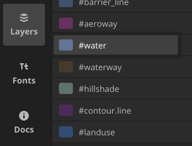 </td>
<td>
<pre>
#water {
  polygon-fill: #73b6e6;
}
</pre>
</td>
<td> 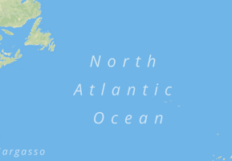</td>
</tr>
</tbody>
</table>

### Properties and values

For each type of data (point, line, polygon, or raster), there are different CartoCSS properties you can apply. You can find all properties and values from the __Docs__ panel in Mapbox Studio Classic. Click on a property to read about how it works and values it accepts.

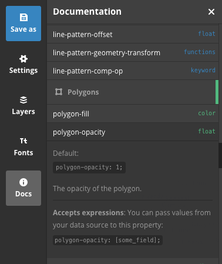

### Code errors

We all make mistakes. Fortunately, Mapbox Studio Classic helps you with code errors by indicating the line of the first error and what may be the problem. You can click the orange highlighted line in the code panel for more specifics. In the example below, Mapbox Studio Classic indicates an error because a `string` value was passed when a `float` numeric value was expected.

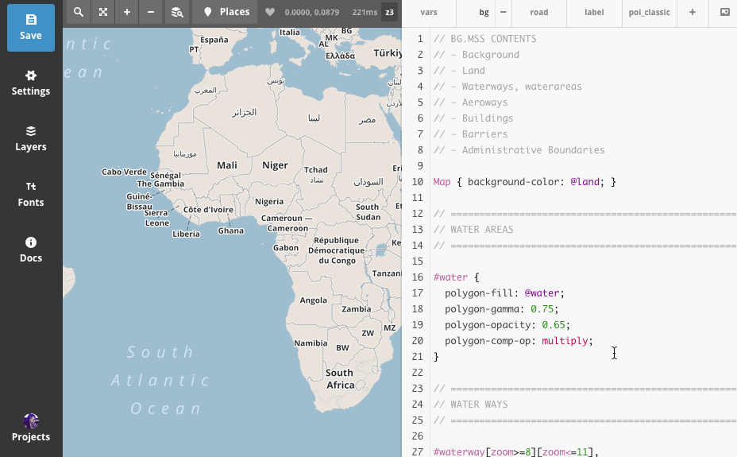

### Zoom levels

With many data layers, displaying all features at every **zoom level** can be difficult to read. For instance, if you zoom into New York City, building number labels are hidden until you've zoomed to a specific building. Without a zoom level, house number labels would *cover* the map.

To prevent this, you can apply styles only to certain zoom levels. This style will only apply when your map is zoomed all the way out to zoom level 0:

```scss
#layer[zoom=0] { /* ... */ }
```

You can also specify ranges of zoom levels using two filters:

```scss
#layer[zoom>=4][zoom<=10] { /* ... */ }
```

Valid operators for zoom filters are:

operator | function
---------|---------
=        | equal to
!=       | not equal to
&gt;     | greater than
&lt;     | less than
&gt;=    | greater than or equal to
&lt;=    | less than or equal to

You will find that zoom levels are added to almost all layers by default -- it's an important technique to keep your map layers and features organized.

### Filter selectors

Sometimes you don't want to style an entire layer the same way. For example, the `#roads` layer contains motorways, streets, paths, and other types of roads, all of which can be styled differently to indicate their use. Many layers' features have _attributes_, or descriptive information, which can be used to style features differently within the same layer. Attributes include both text and numerical values.

In CartoCSS, _filters_ allow you to target every feature whose attributes meet a particular condition. You can find the attributes for a layer by going to the **Layers** panel and clicking on that layer.

If you want to style all the motorways in the roads layer, you can add the attribute name (`class`) and value (`motorway`) to the layer selector. All the styles between the curly brackets will *only* apply to the features classified as `motorway`:

```scss
#road[class='motorway'] {
  line-join: round;
  line-color: #800, 75;
}
```

The same comparison operators available for the zoom filter can also be used to filter based on numeric attributes. For example, you might have a `population` field in a source full of city points. You could create a style that only labels cities with a population of more than 1 million.

```scss
#cities[population>1000000] {
  text-name: [name];
  text-face-name: 'Open Sans Regular';
}
```
As with zoom levels, you can select data based on numeric ranges.

```scss
#cities[population>100000][population<2000000] { ... }
```
<!-- comment -->

### Variables

A **variable** in CartoCSS is declared with an `@` followed by the `variable-name`. A variable is a way of saving information to use over and over again. Before you can use a variable, you must assign it a value.

A common example is water; typically, you want to use the same color for water no matter where it appears on your map.

```scss
@water: #73b6e6;
```

Now that the variable is set, you can use `@water` as a value for any color property.

```scss
#water {
  polygon-fill: @water;
}
```

You can create a variable for *any* CartoCSS value (for example, you can assign a variable for font names, line widths, or languages). You don't have to use variables when styling, but they help  keep values that you use more than once consistent and easy to update. For example, in Streets Classic, the `@water` variable is used *seven* times. If you wanted to change the color, rather than manually changing each of those seven instances, you can update the color just in the variable declaration.

## Styling labels

### Fonts

Mapbox Studio Classic includes over 300 professional fonts licensed from FontShop and Monotype for use exclusively with the app.

You may:

- Use pro fonts in projects you design in Mapbox Studio Classic.
- Publish styles using pro fonts to your Mapbox account.
- Print/export static images from style projects using pro fonts.

You may not:

- Copy or redistribute pro fonts font files outside of the Mapbox Studio Classic app.
- Make use of pro fonts in a fork or derivative copy of Mapbox Studio Classic.
- Include pro fonts in maps you publish that are not through your Mapbox account.


### Basic point labels

In CartoCSS, all the properties beginning with `text-` are used for labeling. All text-related styles must have the following properties:

- `text-name` specifies what text goes in the labels.
- `text-face-name` specifies the typeface(s) that will be used to draw the label. (You can see which typefaces are available from the _Fonts_ panel.)

The `text-name` property can pull text from your layer's data fields. If your layer contains a column called `name_en`, a simple label style would look like this:

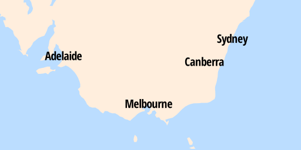

```scss
#place_label {
  text-name: [name_en];
  text-face-name: 'Open Sans Condensed Bold';
}
```

By default, the color and size of these labels are black and 10px. You can change these values with  the `text-fill` and `text-size` properties.


```scss
#place_label {
  text-name: [name_en];
  text-face-name: 'Open Sans Condensed Bold';
  text-fill: #036;
  text-size: 20;
}
```

To separate your text from the background, you can add an outline or _halo_ around the text. You can control the color with `text-halo-fill` and the width (in pixels) with `text-halo-radius`. In the example below, we are using the `fadeout` color function to make the white halo 30% transparent.

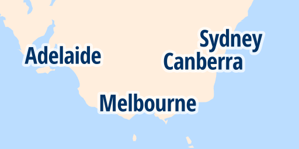

```scss
#place_label {
  text-name: [name_en];
  text-face-name: 'Open Sans Condensed Bold';
  text-fill: #036;
  text-size: 20;
  text-halo-fill: fadeout(white, 30%);
  text-halo-radius: 2.5;
}
```

### Labels along lines

You can style labels that follow a line such as a road or a river by adding the `text-placement` property. Change the default value from `point` to `line`.


```scss
#waterway_label {
  text-name: [name_en];
  text-face-name: 'Open Sans Condensed Bold';
  text-fill: #036;
  text-size: 20;
  text-placement: line;
}
```

### Labeling polygons

To effectively label polygons in Mapbox Studio Classic, you'll need to create a point layer of where you want your labels to be placed. With vector tiles, a polygon might be split across many vector tiles, so if you use `text-placement: point`, you will end up with lots of duplicate labels. Rather than manually creating a point layer, you can calculate the centroid of each of your polygons using a tool such as QGIS or PostGIS. Once you've created your centroid point layer, you can add it as a source in your Mapbox Studio Classic project and style it the same way you would any other point layer with CartoCSS.


### Custom text

Labels aren't limited to pulling text from just one field. You can combine data from many fields as well as text to construct your `text-name`. For example, you can include a point's type in parentheses.

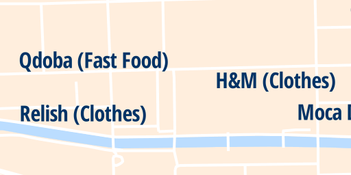

```scss
#poi_label {
  text-name: [name_en] + ' (' + [type] + ')';
  text-face-name: 'Open Sans Condensed Bold';
  text-size: 16;
}
```

You can also assign any text to labels that does not come from a data field. Due to a backwards-compatibility issue, you will need to quote such text twice for this to work correctly.

```scss
#poi_label[maki='park'] {
  text-name: "'Park'";
  text-face-name: 'Open Sans Regular';
}
```

### Label language

The `text-name` property sets the language of the labels on the map. You can either specify a language for the labels, or you can have the labels be localized to a particular area. The code below sets the label language to English:

```scss
#country_label {
  text-name: '[name_en]';
}
```

For most Mapbox styles, our designers saved the language of the labels as a `@name` variable. This means that if you're customizing a Mapbox style, you only need to update the value of the `@name` variable and all the labels will update to that language.

```scss
@name: '[name_en]';

#country_label {
  text-name: @name;
  ...
}

#place_label {
  text-name: @name;
  ...
}
```

Here are the current languages that Mapbox supports, their CartoCSS values, and what they look like on the map.

Language  | Value    | Preview
----------|----------|--------
localized | `name`   | 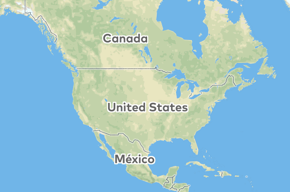
English   | `name_en`| 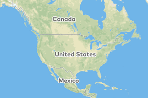
French    | `name_fr`| 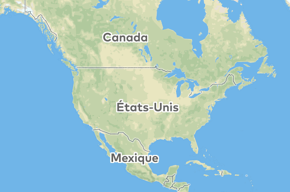
Spanish   | `name_es`| 
German    | `name_de`| 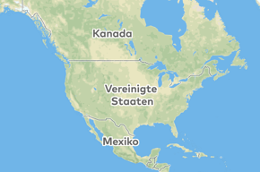

Keep in mind that some fonts will not have every character, so be sure to use the Places tab to see how your labels look in all areas of the world.


## Styling lines

You can apply line styles to both line and polygon layers. The simplest lines have just a `line-width` (in pixels) and a `line-color` making a single solid line. The default values for these properties are `1` and `black`.

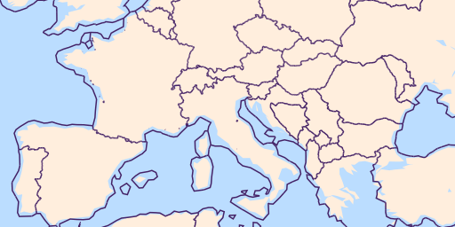

```scss
#admin[admin_level=2] {
  line-width: 0.75;
  line-color: #426;
}
```

### Dashed lines

You can create simple dashed lines with the `line-dasharray` property. The value of this property is a comma-separated list of pixel widths that will alternatively be applied to dashes and spaces. This style draws a line with 5 pixel dashes separated by 3 pixel spaces:

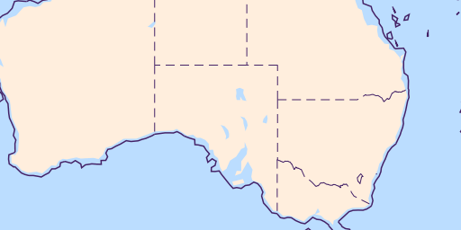

```scss
#admin[admin_level>=3] {
  line-width: 0.5;
  line-color: #426;
  line-dasharray: 5, 3;
}
```

## Compound line styles

### Roads

For certain types of line styles, you may want to style and overlap multiple line styles. For example, a road with casing:

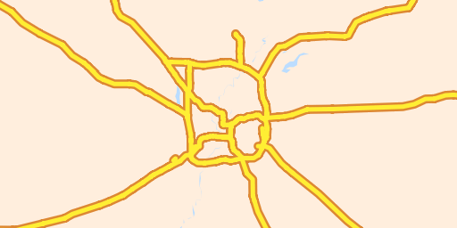

```scss
#road[class='motorway'] {
  ::case {
    line-width: 5;
    line-color: #d83;
  }
  ::fill {
    line-width: 2.5;
    line-color: #fe3;
  }
}
```

## Styling polygons

Polygons can be filled with a solid color or a pattern, and also given an outline.

_Everything covered in the styling lines guide can also be applied to polygon layers._

### Basic styling

The simplest polygon style is a solid color fill.

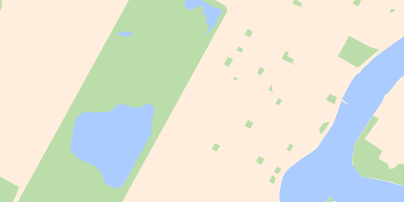

```scss
#landuse[class='park'] {
  polygon-fill: #bda;
}
```

If you want to adjust the opacity of `polygon-fill` you can use the `polygon-opacity` property. The value of this property is a number between 0 and 1, where 0 is fully transparent and 1 is fully opaque. A lower opacity allows you to see overlapping shapes in the same layer.

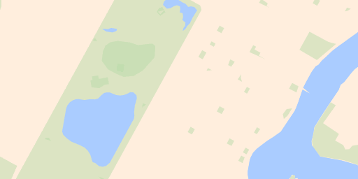

```scss
#landuse[class='park'] {
  polygon-fill: #bda;
  polygon-opacity: 0.5;
}
```

### Patterns and textures

With CartoCSS, you can fill areas with textures and patterns by bringing in external images. You can create the patterns yourself with image editing software, or find ready-made images from third-party websites.

You can add a pattern style from any local file using the `polygon-pattern-file` style. Here's a simple diagonal stripe pattern. To add a pattern, save an image file to your style's `.tm2` folder and reference it from CartoCSS as shown in the snippet below.


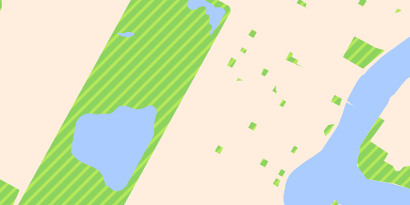

```scss
#landuse[class='park'] {
  polygon-pattern-file: url('pattern-stripe.png');
}
```

## Remove labels or features

No matter what data you have in your project, layers will only show up on the map if you set a specific style for them. You can remove any layer or feature by *not* styling it. You can delete or [comment out](https://developer.mozilla.org/en-US/docs/Web/CSS/Comments) any style to remove it from the map.
