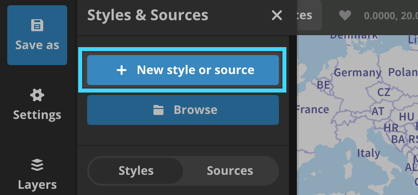
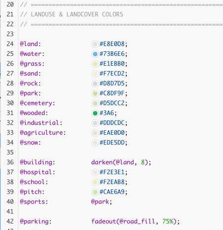
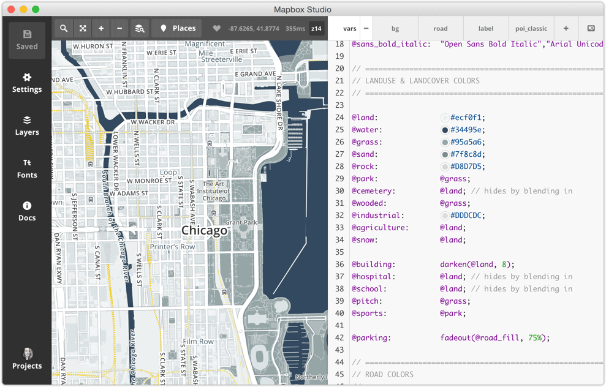
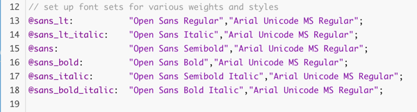
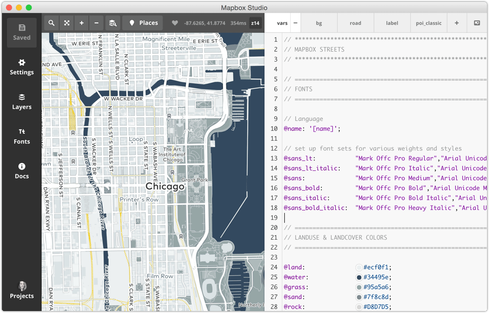
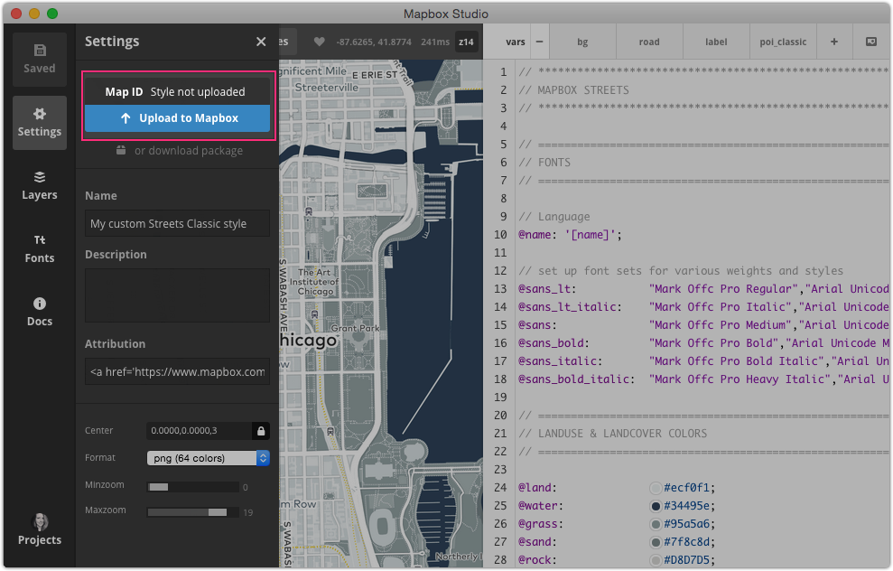

# Create a custom style in Mapbox Studio Classic

This guide will walk through creating a custom style in **Mapbox Studio Classic** using CartoCSS. You'll start with a list of colors and apply them to the Mapbox Streets Classic style. In the end, you'll have created a custom map style that can be used in a web application. 

## Getting started

Here are a few resources you'll need before getting started:

- **Mapbox account**. Sign up for free at [mapbox.com/sign-up](https://www.mapbox.com/studio/signup/). You will be uploading your map style to your Mapbox account at the end of this tutorial. 
- **Mapbox Studio Classic**. If you haven't already, make sure to [**download and install Mapbox Studio Classic**](https://github.com/mapbox/mapbox-studio-classic).
- **Style guidelines**. Although not necessary, it is often helpful to start with some broad style guidelines when creating a custom map style. Here are the style guidelines for this guide:

- `#ecf0f1`
- `#95a5a6`
- `#34495e`
- `#f1c40f`

## Customize the style

Open Mapbox Studio Classic and click on **Styles &amp; Sources** in the lower left corner of the application. Click **+ New style or source** to open the New style and source window.



Click the **Classic Streets** style to open the style.


### Color variables

Give Streets Classic a new color scheme based on a simple color palette. For this section, you'll work entirely in the "vars" tab CartoCSS. Scroll down to where it says `LANDUSE & LANDCOVER COLORS`.



- Change the land color to a very light blue using `@land: #ecf0f1;`.
- Click **Save As** to save your project locally.
- Click **Places** to see different views of your style.
- Change the water color to a darker blue using `@water: #34495e;`.
- Change the grass color to a steely gray using `@grass: #95a5a6;`.
- Click **Save** to see your changes.

For the remaining color variables, you will reuse a couple variables. Here's the complete code, but feel free to try your own colors:

```scss
@land:              #ecf0f1;
@water:             #34495e;
@grass:             #95a5a6;
@sand:              #7f8c8d;
@rock:              #d8d7d5;
@park:              @grass;
@cemetery:          @grass;
@wooded:            @grass;
@industrial:        #dddcdc;
@agriculture:       @land;
@snow:              @land;

@building:          darken(@land, 8);
@hospital:          @land;
@school:            @land;
@pitch:             @grass;
@sports:            @park;

@parking:           fadeout(@road_fill, 75%);
```

Finally, highlight the railways by making them yellow. Railways are located in the `ROAD COLORS` section of the "vars" tab. Change the railway color to yellow using `@rail_line` to `#f1c40f;`. Click **Save** to see your changes.



### Font variables

For this style, font families are stored as variables in the "vars" tab. Each variable represents a different font weight and style. The Streets Classic style uses `Open Sans` with `Arial` as a fallback font.



For your custom style, you will use `Mark Offc Pro` with `Arial` as a fallback font. To change fonts:

- Click **Fonts** from the Mapbox Studio Classic toolbar on the left.
- Find "Mark Offc Pro" and click on it to see its weights and styles.
- Replace each font variable value with the new font name using the code below.
- Click **Save** to see your styles changes.

Your font variables should look like this:

```scss
@sans_lt:           "Mark Offc Pro Regular","Arial Unicode MS Regular";
@sans_lt_italic:    "Mark Offc Pro Italic","Arial Unicode MS Regular";
@sans:              "Mark Offc Pro Medium","Arial Unicode MS Regular";
@sans_bold:         "Mark Offc Pro Bold","Arial Unicode MS Regular";
@sans_italic:       "Mark Offc Pro Bold Italic","Arial Unicode MS Regular";
@sans_bold_italic:  "Mark Offc Pro Heavy Italic","Arial Unicode MS Regular";
```

The map should now display labels using `Mark Offc Pro`. 



## Upload and publish

Congratulations! You've created a custom style with Mapbox Studio Classic. Next, upload the style to your Mapbox account so it can be used on the web. 

Click the **Settings** icon the left. In the Settings panel, click **Upload to Mapbox**. Once the upload has succeeded, a [map id](https://www.mapbox.com/help/define-map-id/) will appear above the upload button and your style will be available in your [Mapbox account](https://www.mapbox.com/studio/classic). 



## Next steps

Your map style is now deployed Mapbox on your [Classic](https://www.mapbox.com/studio/classic/) page and has a __map ID__. You can use this map with any of the [Mapbox developer APIs](https://www.mapbox.com/developers) to integrate into your apps and sites.
