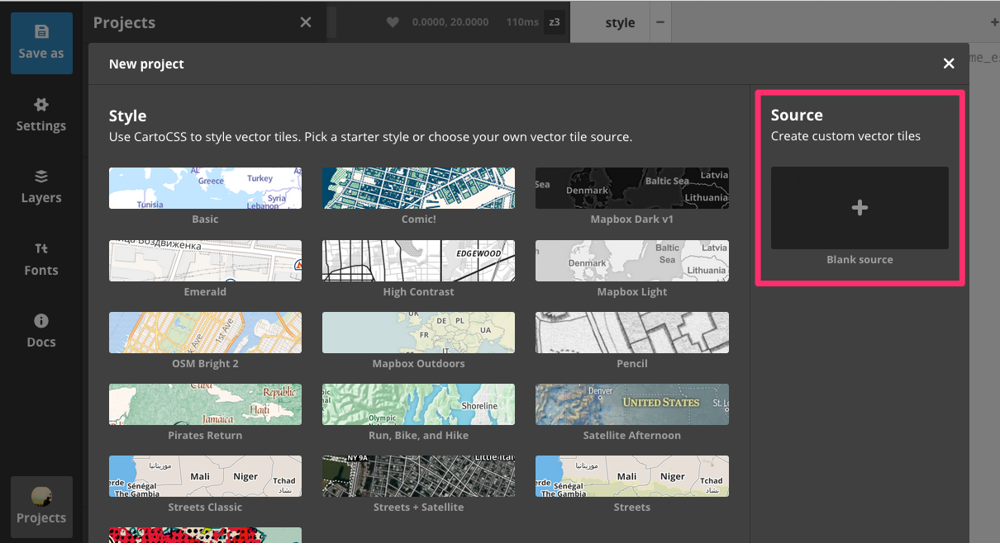
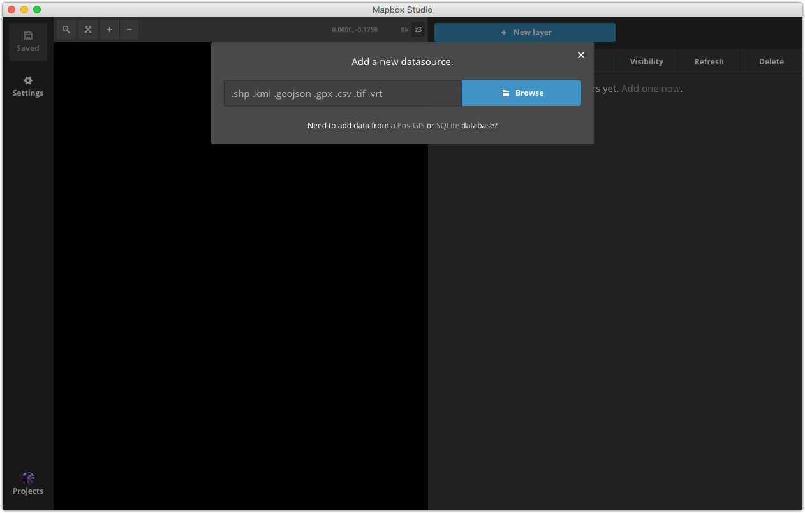
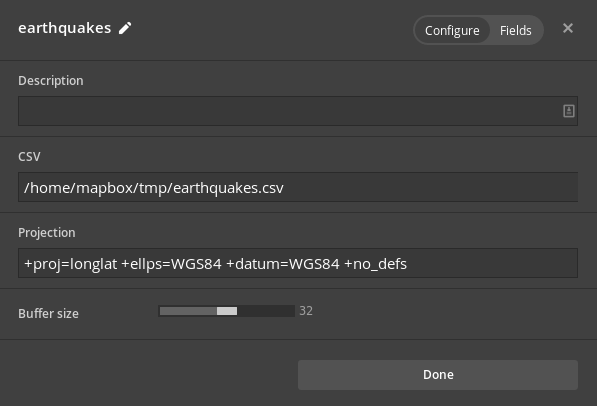
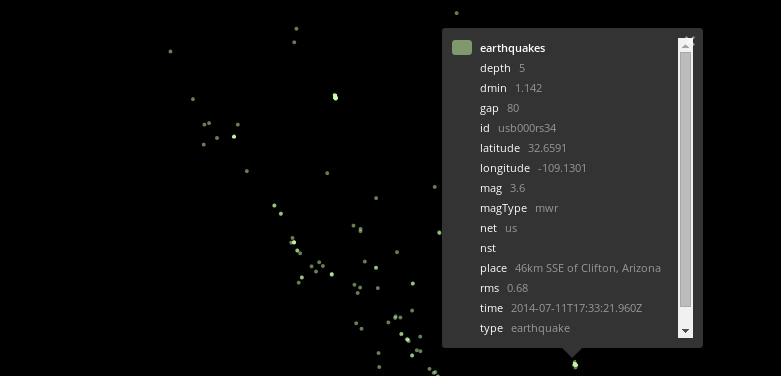
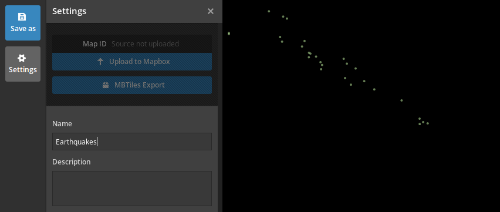
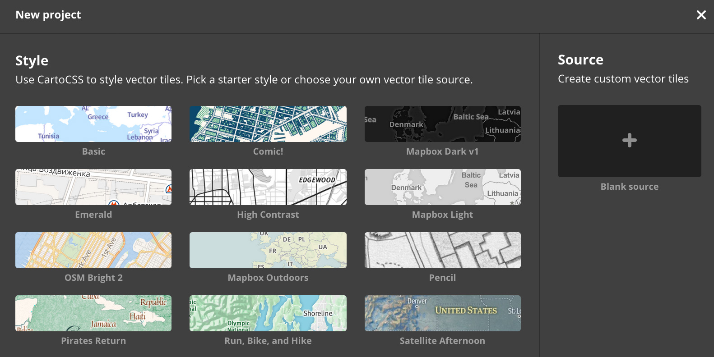
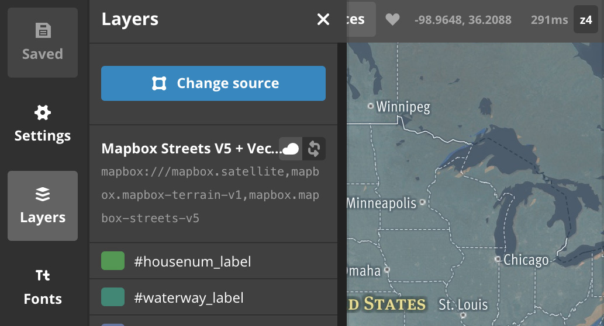
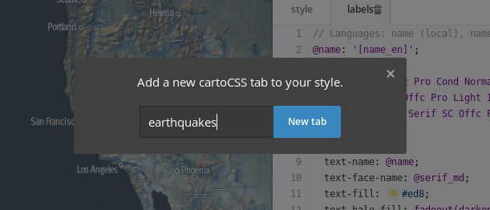
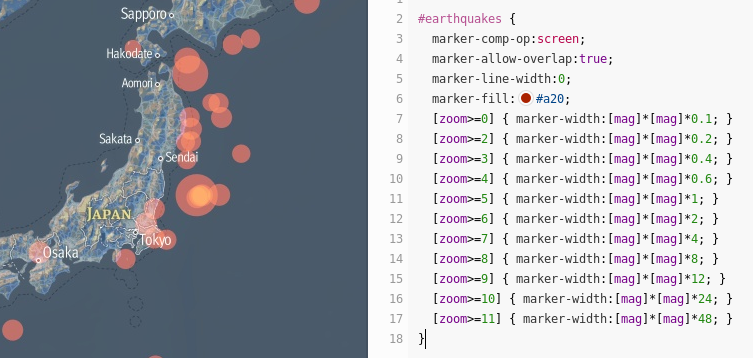
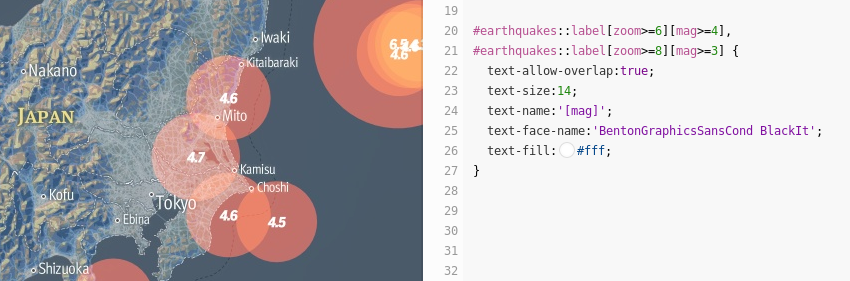

# Mapbox Studio Classic source quickstart

When you import geospatial data, Mapbox Studio Classic doesn't apply visual styles to your files directly. Instead, Mapbox Studio Classic converts the raw data into [Mapbox Vector Tiles](https://github.com/mapbox/vector-tile-spec). Mapbox Studio Classic's *source editor* transforms traditional geodata formats into vector tiles containing the appropriate layers and configurations needed for styling.

In this guide, you'll import a [CSV file with earthquake data from the USGS](http://earthquake.usgs.gov/earthquakes/feed/) and create vector tiles from the data. You'll add the source as a layer and create a custom map style showing points for all the earthquakes that have occurred.

If you're new to Mapbox Studio Classic, we recommend going through the [CartoCSS section](../studio-classic-manual/04-classic-manual-cartocss.md) of the Mapbox Studio Classic manual and [Mapbox Studio Classic style quickstart](./style-quickstart.md) guides before continuing.

## Getting started

Here are a few resources you'll need before getting started:

- **Mapbox account**. Sign up for free at [mapbox.com/studio/sign-up](https://www.mapbox.com/studio/signup/). You will be uploading your map style to your Mapbox account at the end of this tutorial.
- **Mapbox Studio Classic**. If you haven't already, make sure to [**download and install Mapbox Studio Classic**](https://github.com/mapbox/mapbox-studio-classic).
- **Earthquake data**. Download and save the file locally and rename it `earthquakes.csv`.

<a href='http://earthquake.usgs.gov/earthquakes/feed/v1.0/summary/2.5_month.csv' class='txt-bold btn color-white'>Download earthquake data</a>

## Create a custom source

Open Mapbox Studio Classic and click on **Styles &amp; Sources** in the lower left corner of the application. Click **+ New style or source** to open the New style and source window.


### Upload data

From this menu, create a New source by clicking a **Blank source**.



Next, add a new layer, by clicking **New layer** and then **Browse** to find and select `earthquakes.csv`.



Your layer settings are on the right:

- You can add a "description" if you'd like.
- The "CSV" field will include the file path for your data source.
- Verify that "Projection" is set correctly. This field will also autofill with metadata from the file and it should reference **WGS84**. Mapbox Studio Classic autodetects the projection of most geodata files. If you have data that does not have its projection autodetected, report it as an [issue on GitHub](https://github.com/mapbox/mapbox-studio-classic/issues).
- Set the "Buffer size" slider to **32**. The vector tile buffer determines how much extra data is included around the edges of each tile and can be used to prevent visual clipping artifacts when styling data.



### View field descriptions

Click on the **Fields** toggle to view all the fields present for this layer and descriptions of each field.

Field descriptions are a helpful guide to the contents of each property and how it might be used when styling. The USGS website includes a [Glossary](https://earthquake.usgs.gov/learn/glossary/) describing their data fields. Field descriptions are not necessary for this tutorial, but can be helpful for other projects. 

Click **Done** to see your new layer. Mapbox Studio Classic automatically assigns the layer a color and style in the data preview. You may need to zoom and pan a little at first to see your data.

### Inspect data properties

The map preview pane shows points and each point represents a distinct earthquake. Click on any point on the map to inspect the data for that earthquake. The layer name and color are shown so you can inspect multiple layers if features overlap. You'll use these data fields later when styling this source.



### Set source name and save

Open the **Settings** panel on the far left. Here, you can set information about your project as a whole, such as a name, description, and attribution info for your data sources.

Change the name of the project to 'Earthquakes' so when it's uploaded you'll be able to find it.



Click **Save As** to save your project locally. Mapbox Studio Classic source projects are saved as a directory of files with the extension `.tm2source`.

### Upload data

Upload your source project from the **Settings** pane by clicking **Upload to Mapbox**. Uploading a Mapbox Studio Classic source project to your Mapbox account will allow you to style your source in the Style editor.


Mapbox Studio Classic has converted your source data to vector tiles. Once the upload is done processing, click **Back** to return to the previous screen. Click the **Settings** icon on the left and copy the [map ID](https://www.mapbox.com/help/define-map-id) that appears above the upload button. You will use this map ID to add your custom vector tiles to a map style.

## Style custom data

Next, you'll style your custom data. Click on **Styles &amp; Sources** in the lower left and then **New style or source**. Select the **Satellite Afternoon** style to get started.



### Change source

Before you change your style's source, click **Save as** to save your style project locally. Click on **Layers** to open the layers panel and then click **Change source**.



In the input field, add a comma at the end of the current vector sources and paste the __map ID__ of your vector source to the end of the list of sources (with *no space* after the comma).

```html
mapbox.satellite,mapbox.mapbox-terrain-v2,mapbox.mapbox-streets-v6,{map-id}
```

Mapbox will automatically composite, or combine, the existing sources (Mapbox Satellite, Mapbox Terrain, Mapbox Streets) with your new source. Click **Apply** after you enter your source's map ID.

### Style with CartoCSS

Click the plus button on the top right of the style editor to add a new CartoCSS tab. Name your tab "earthquakes". You'll add all of the styles for the earthquake data here.



To style each point where an earthquake has occurred, add the following CartoCSS to your "earthquakes" stylesheet and  click **Save** to see your changes.

```scss
#earthquakes {
  marker-comp-op: screen;
  marker-allow-overlap: true;
  marker-line-width: 0;
  marker-fill: #a20;
  [zoom>=0] { marker-width: [mag] * [mag] * 0.1; }
  [zoom>=2] { marker-width: [mag] * [mag] * 0.2; }
  [zoom>=3] { marker-width: [mag] * [mag] * 0.4; }
  [zoom>=4] { marker-width: [mag] * [mag] * 0.6; }
  [zoom>=5] { marker-width: [mag] * [mag] * 1; }
  [zoom>=6] { marker-width: [mag] * [mag] * 2; }
  [zoom>=7] { marker-width: [mag] * [mag] * 4; }
  [zoom>=8] { marker-width: [mag] * [mag] * 8; }
  [zoom>=9] { marker-width: [mag] * [mag] * 12; }
  [zoom>=10] { marker-width: [mag] * [mag] * 24; }
  [zoom>=11] { marker-width: [mag] * [mag] * 48; }
}
```

The code above does the following:

- `marker-width: [mag]*[mag]*n` properties draw each earthquake point as a circle scaled by its `[mag]` field.
- `[zoom>=n]` selectors increase the size of each circle as you zoom in.
- `marker-allow-overlap: true` allows the circles to be drawn over each other.
- `marker-comp-op: screen` switches the blend mode of the markers so overlapping circles create an interesting visual affect.

Your map should now show all of the points as semi-transparent circles that vary in width based on the magnitude associated with each point.



### Add labels

Next, add labels so that the earthquakes with a large magnitude are labeled clearly on the map. Add the following CartoCSS to your "earthquakes" stylesheet and then click __Save__.

```scss
#earthquakes::label[zoom>=6][mag>=4],
#earthquakes::label[zoom>=8][mag>=3] {
  text-allow-overlap: true;
  text-size: 14;
  text-name: '[mag]';
  text-face-name: 'Open Sans Regular';
  text-fill: #fff;
}
```

The code above does the following:

- `#earthquakes::label` defines a new `label` CartoCSS attachment. The properties in this attachment will be drawn on top of any previous `#earthquake` layer rules.
- `text-allow-overlap: true` allows text to be drawn on top of markers and other labels.
- `text-name: '[mag]'` sets the layer field to use for the contents of the text labels.

Your map should now have labels for the large magnitude earthquake points.



## Upload

Congratulations! You have created a custom style with Mapbox Studio Classic. Next, upload the style to your Mapbox account so it can be used on the web.

Click the **Settings** icon the left. You can change your style's settings from this panel at anytime, but you'll need to upload again to reflect changes. In the Settings panel, click **Upload to Mapbox**. Once the upload has succeeded, a [map id](https://www.mapbox.com/help/define-map-id/) will appear above the upload button.


## Next steps

Your map style is now deployed Mapbox on your [Classic](https://www.mapbox.com/studio/classic/) page and has a __map ID__. You can use this map with any of the [Mapbox developer APIs](https://www.mapbox.com/developers) to integrate into your apps and sites.
